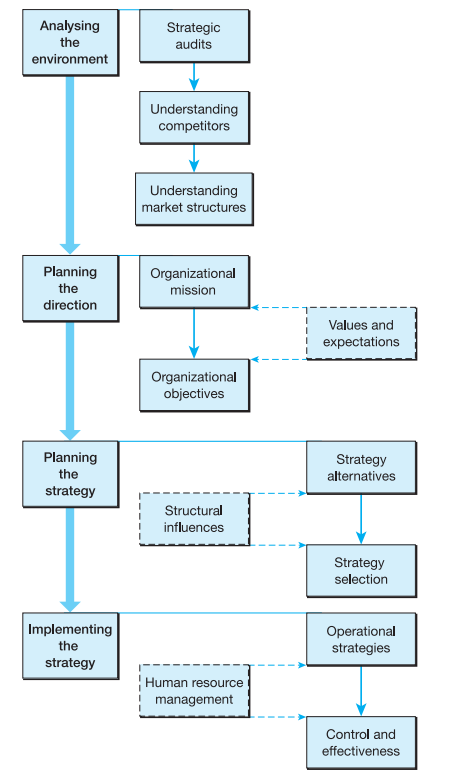
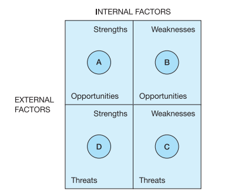
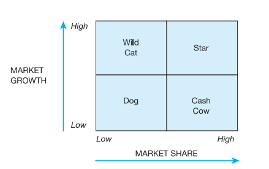
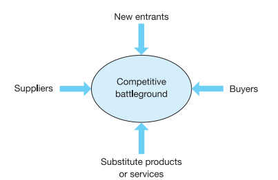
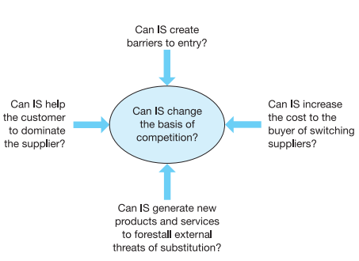

# Book: Project Management for Information Systems

## Chapter 1: Types of information systems projects
### Learning Outcomes 
- List nine distinct types of IS project that may be encountered
- Describe two key characteristics of each of these nine types of IS project
- Describe the particular skills required by project managers to manage each of the types of IS project
- Describe how to tailor the project management approach for smaller IS projects

### Nine Types of IS Projects:
- Software development
- Package implementation
- System enhancement
- Consultancy and business analysis assignments
- Systems migration
- Infrastructure implementation
- Outsourcing (and in-sourcing)
- Disaster recovery
- Smaller IS projects

#### Software Development Projects
Essentially, we have a group of people working together to specify, design, develop, test and implement a new system for a 'customer'
It is usually quite hard for the users of a piece of software to express their wishes clearly and for the business analysts to capture them unambiguously

The manager of software projects need:
- Flexibility of approach in being prepared to revisit specification and negotiate with the customer as the project proceeds
- Well-developed interpersonal and stakeholder-management skills
#### Package Implementation Projects
Buying a pre-existing software package and installing is an alternative method that is quicker and cheaper to meet the customers' system requirements

The manager of a package implementation project:
-  Managing the series of sub-projects (customization/tailoring, migration/cleansing, user training, cutover from old to new system)
- Ensuring that the suppliers live up to any claims and its suitability for the organization
- Keeping the purchasers and users of the package realistic in their demands for changes and tailoring

#### System Enhancement Projects
Arises when the users, or owners, of an existing system want it enhances to provide new features or functions or perhaps to meet some external demand.

The manager of a large enhancement project:
- The difficulty of keeping the existing system operational while work proceeds on the enhancement
- Developers involved with supporting the system might have a hard time to balance and reconcile the competing demands on their time
- The need of rigorous 'regression testing'

#### Consultancy and Business Analysis Assignments
Involves investigating a business issue and proposing solutions using information technology.

Difficulties from management perspective:
- Difficult to estimate, plan for and control
- Budget and timescale for the project ought to be fairly flexible (however customers want 'answers')
- Hard to fix the scope of consultancy projects

#### Systems Migration Projects
An existing operational system has to be move to a new operating environment. The project's success will be judged by the smoothness of the transition and lack of interruption to their workload

#### Infrastructure Projects
This type of IS project includes ones to introduce or replace hardware, servers of PCs. Outcomes of the project are nicely tangible.

The manager of infrastructure projects:
- Need to maintain 'business as usual' whilst putting in place the new infrastructure
- Supplier management features heavily in these projects, as most of the work is usually subcontracted and all of the equipment is bought-in

#### Outsourcing (and In-sourcing) Projects
Organizations outsource IT provision for several reasons, such as accessing the expertise of outsourcing providers, difficulty in managing IT internally, reducing costs through economies of scale or lower labor costs, and decreasing employee headcount. Outsourcing IT is often treated like other utilities, with some believing IT has become commoditized and no longer offers competitive advantage. However, dissatisfaction with loss of control has led some organizations, like a major UK supermarket, to bring IT back in-house. Outsourcing or in-sourcing projects are complex, requiring due diligence, asset transfers, training, and handling of employment contracts. Given the complexity and interdependencies, these projects are often managed as a coordinated program, requiring not only technical project management skills but also strong interpersonal abilities to handle the various stakeholders involved, such as staff, unions, suppliers, and legal experts.

#### Disaster Recovery Projects
Disaster recovery (DR) projects are crucial when an organization faces large-scale failures, with the main goal of restoring systems and ensuring business continuity as quickly as possible. Disasters can stem from natural causes, malicious attacks, or unforeseen accidents like power failures. While preventive measures are ideal, no organization is immune to unexpected threats, making pre-planning vital for effective recovery. A comprehensive DR plan, ready-to-deploy resources, and coordination with suppliers and internal teams are essential. Key challenges for DR managers include maintaining calm, instilling confidence, and conducting regular tests (drills) to ensure preparedness.

#### Small IS Projects
For small IS projects, the rigor of full-scale project management may seem excessive, but the approach should be pragmatic and adjusted to the project's size. While formal estimation, planning, and reporting can be simplified, one essential element that should never be skipped is the creation of a Project Initiation Document (PID). The PID clearly defines the project’s purpose, scope, and constraints, helping to avoid misunderstandings. For smaller projects, estimates and plans can be basic, and progress reports may take the form of simple updates like weekly emails. The key is to maintain adequate control while keeping the process proportionate to the project's scale.

## Chapter 2: Business strategy and information systems

### Learning outcomes
- Explain how an organization's strategy impacts on the development of IS projects
- List the characteristics of a good strategy
- List three business analysis tools used in strategy development
- Describe a process for developing a strategy
- Summarize how strategy interacts with other factors to determine an organization's effectiveness
- Suggest some ways in which information systems can support the development of competitive strategies

This chapter discusses the business context in which systems projects are created, emphasizing how organizational strategy shapes business processes and systems. The systems planning activity aligns business goals, such as profit or customer service, with the development of computer systems to meet key result areas (KRAs). The chapter also highlights the importance of understanding the broader business environment to ensure that information systems align with an organization's overall strategy.

### What is strategy all about?
- Strategy is the pattern or plan that integrates an organisation's major goals, policies and actions into a cohesive whole
- Strategy is the result of a careful analysis and it is purposeful; it is a plan for achieving something

A good strategy is: 
- _Clear_ - overriding goals for all units of the enterprise are clear enough to give continuity and cohesion to all of the tactical choices 
- _Keep the initiative_ - preserves freedom of action, supports empowerment and enhances commitment
- _Concentrated_ - concentrates resources at the place where, and the time when, they will generate maximum advantage
- _Flexible_ - being well balanced to take advantage of changes that occur
- _Well led_ - good leadership is needed to turn a strategy into competitive advantage
- _Full of surprises_ - we gain advantage out of proportion to the effort expended by doing the unexpected

According to Mintzberg, to see strategy is:
- _A plan_ - intended course of action to deal with a situation
- _A pattern_ - we consistently behave in a certain way and it leads us to formalize this pattern of behavior into a strategy
- _A position_ - describes how we position ourselves in our market
- _A perspective_ - describe strategy as a set of values

### Developing a strategy

#### Analytical Tools:
- **SWOT** - Strengths, Weaknesses, Opportunities and Threats
	
- **PESTEL** - Political, Economic, Socio-cultural, Technological, Environmental, Legal
- **Balanced Business Scorecard:**
	- Customer perspective - how customers see the organization (market share growth, customer profitability, response and delivery times, defect rates, etc..)
	- Internal Business perspective - how well our business is running
	- Employee perspective (learning and growth perspective) - constant development of employees 
- **Boston Consulting Group Matrix** - models the relationship between a product or service's current and future potential and how management wants to deal with it
	

### Competition and strategy
- Porter _"the essence of strategy formulation is dealing with competition"_ 
- Porter's **five forces model**:
	- Rivalry
	- New entrants
	- Substitute products or services
	- Suppliers
	- Buyers
	
	

- Robson's analysis of the five forces and IS opportunities:
	

Gregory Parsons Six Strategies for the Development of Information Systems:
- Centrally planned - planning cycles for business and IS are closely linked
- Leading edge - belief that innovative technology can create organizational gains and that the risky investment can generate big paybacks
- A free market - users make the decisions since they are the ones who have to live with the results and deliver the profits
- Monopoly - belief that information is a corporate asset that should be available across the whole company
- Scarce resource - where the scope of the IS function is deliberately limited by budget constraints and users' projects compete for service from the scarce resources using strict cost/benefit criteria
- Necessary evil - where organizations see the development of ISs as a necessary evil and believe that information is not important to their business

### Strategy and culture
Organizational change depends on the relationship and interactions between (McKinsey model):
1. Strategy - the action that an organization takes based on its assessment of the environment which it defines as its customers and its competitors
2. Structure - organization structure
3. Systems - things that keep the organization going, day by day
4. Style - management style
5. Skills - dominating attributes or capabilities of the organization
6. Staff - recruitment, appraisal, pay scales, etc. and moral, motivation, attitude, commitment, etc.
7. Shared values - guiding concepts, the values and aspirations that make us want to work here, that give meaning to what we do

