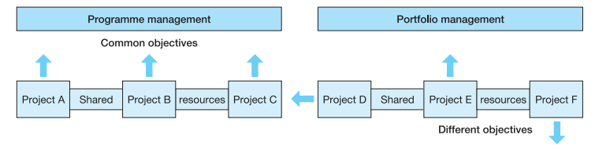
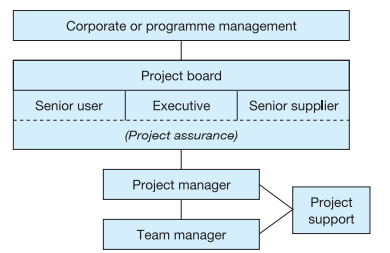

# Book: Project Management for Information Systems

## Chapter 3: The business case
### Learning outcomes
- Describe the structure of a business case
- Use the payback, discounted cash flow and the internal rate of return methods to calculate the financial implications of a business case
- Differentiate between tangible and intangible costs and benefits

A business case provides the base for business-level monitoring and control and, ultimately, for assessing whether the project was worth undertaking at all

### Content and format of a business case
1. **Introduction and background** - short introduction setting out what the document is about and sketching any background to the proposed project
2. **Management summary** - is the most important part as it might be the first and only part that the decision makers will turn to. It consists of:
	- A statement of what is the problem or opportunity that the project is intended to address
	- A resume of the options considered and why those not chosen have not been recommended
	- A statement showing which option has been recommended, why, and what business benefits are expected to flow from it
3. **Description of problem or opportunity** - problem that the project is designed to solve or the opportunity it should address
4. **Options available and considered** - Those that are not to be recommended should be described briefly and the reasons for rejecting them should be made clear. The option that is to be recommended should be described in more detail, to allow the readers to see what exactly is being proposed.
5. **Cost/benefit analysis** - presents a description and, where possible, a quantification of the costs of carrying out the project and of the benefits that are expected to flow from it. Costs and benefits are:
	- tangible (which means they can be plausibly quantified in some way) or intangible (which means that they cannot be so quantified), and
	- incurred/enjoyed immediately or in the longer term
6. **Impacts and risks**
	- Impacts, in short, are changes in the way an organization thinks and acts and are worth spelling out in a business case so that the decision-makers can judge whether the proposed changes are feasible or not
	- Outline of the principal risks associated with the recommended option together with the proposed measures for either avoiding or mitigating them, will raise the confidence of the decision-makers that the proposal has been thought through properly
7. **Conclusions and recommendations** - the recommended way forward should be described and the decision that is needed should be set out clearly
8. **Other possible inclusions**

### Investment appraisal (*financial implications)
1. **Payback**
2. **Discounted cash flow**
3. **Internal rate of return**

### Presenting the business case
Four-part formula to present the business case:
1. **Aim** - What decision needs to be made?
2. **Audience** - Who are the decision-makers and what are they interested in?
3. **Arrangement** - using a logical order to present the materials
4. **Appearance** - must be easy for the decision makers to find what they are looking for

### Benefits realization and management
Aim to manage the project in such a way as to maximize the chance of the benefits being achieved. The key to any benefits realization effort is the business case as this is where the benefits have been identified and, where possible, quantified. From the business case, a set of criteria should be developed against which the achievement of the benefits will be measured.

## Chapter 4: The organizational framework
### Learning outcomes
- Prepare organizational structure charts for a functional organization structure, a project structure and a matrix structure
- Identify the key roles and responsibilities in an IS project
- Define programme and project management

### Introduction to organization structure
1. **Functional organization** 
	- The organization is divided into a number of departments, each specializing in one aspect of the business
	- A great problem with functional organizations is that people can develop a ‘silo’ mentality – being more concerned with departmental objectives than with the needs of the organization as a whole
2. **'Pure' project organizations**
	- Set up projects to carry out specific tasks, drawing team members from across the functions. Once the project is over, everyone goes back to their ‘home’ departments
	- Problems:
		- Team members may get out of touch with what is going on in their ‘home’ departments, including important and useful technical developments
		- Functional managers may feel that they have little control or influence over what project teams are doing and this makes it difficult to impose functional policies across an organization
		- They can be rather inefficient in their use of resources, especially people
3. **Matrix organizations**
	- Attempts to balance the benefits of the functional and the pure project structures
	- People have more than one boss
	- Problem: Staff managing their time can prove a major headache for people in matrix structures, since they may have several bosses, with conflicting deadlines, pulling them this way and that

### Project roles and responsibilities
- **Sponsor** - the person who is accountable to the business for the investment represented by the project and for the achievement of the project’s business objectives. Is the ‘owner’ of the project as a piece of business and the sponsor will, ultimately, be responsible for its success or failure in delivering business benefit to the organization
- **User** - the person who will make use of the facilities of the system in their everyday work and is therefore the person most directly affected by the project
- **Project manager** - appointed by the sponsor and is responsible for the manager management of the project on a day-to-day basis and for the achievement of the project objectives
- **Risk manager** - will control the process of identifying, classifying and quantifying the risks and for chasing people to carry out their risk reduction actions
- **Quality manager** - will write the quality plan, develop the quality control procedures, check that these procedures are being followed and provide advice and guidance to team members on quality-related issues
- **Chief analyst** - will advise the project manager and project team on analysis methods and techniques and, with the quality manager, ensure that appropriate standards are being followed
- **Chief designer** - works under the direction of the project manager to control the work of the design team, and probably that of the programmers as well
- **Database administrator** - will develop and enforce standards for the use of the database product, the naming and placement of data items and so on
- **Configuration librarian** - someone needs to assume responsibility for operating the configuration control procedures and, on a large project, this is often a full-time role
- **Team leader** - detailed management of the staff is often delegated to a number of team leaders
- **Project office** - a project office provides administrative support to the project manager. This includes such things as the collection and recording of timesheets, the organization of meetings and the dissemination of information

### Organizing the roles
- **Steering committee** - e is set up to control the development of a particular project – or perhaps a group of related projects – and has representation from the various interested parties
- **User group** - where there are several users for a planned system, it is sometimes useful to group create a forum where they can come together and discuss and reconcile their disparate requirements
- **Risk management committee** - the function of this group would be to review the current status of risks, assign owners to the risks and check that the identified avoidance or mitigation actions are being carried out

### Programme and portfolio management
**Programme Management** - A set of IT projects that are undertaken within an overall strategic business framework that together will contribute to meeting business/organizational objectives and which involve the sharing of a relatively fixed pool of resources in terms of people, equipment and supporting services.

**Portfolio Management** - someone can arbitrate between the competing projects and decide, on a day-to-day basis, which shall have the (usually scarce) resources

### PRINCE2 organization structure
- Projects in Controlled Environments
- A defined management structure
- A system of plans
- A set of control procedures
- A focus on product-based - that is deliverables-based - planning

- At the top of the PRINCE2® hierarchy is the body that sets the overall objectives for IS projects within the organization
- The project board represents the three main constituencies that are interested in the project:
	- The executive chairs the project board. This person is appointed by the organization’s senior management and represents the business interests of the organization. The executive provides overall guidance throughout the project and is ‘first among equals’ on the project board.
	- The senior user represents the interests of the business areas that are affected by the new system and has the authority to speak for all users of the system.
	- The senior supplier represents the developers of the new system. Probably, someone like the organization’s IT director or systems development manager would assume the senior supplier role, though, if the development were being done by outside consultants, perhaps the consultants’ account manager or managing partner might be more suitable.
- The day-to-day management of the project is the responsibility of the project manager and one or more team managers.
- . In practice, there are several ways the project manager/ team manager roles could be operated:
	- There may be one project manager throughout the project, with a different team manager for each stage.
	- The project manager may also assume the team manager role. n A succession of team managers may be appointed, with each also assuming the project manager role for that stage.
	- In a customer and supplier context, the customer may supply the project manager, with the supplier providing the team manager or managers.
- There are three aspects to the project assurance work but the project assurance team may have more or fewer than three members. The three aspects are:
	- Business assurance – evaluating the business aspects of any proposed changes to the project and ensuring that the project continues to be viable in business terms.
	- User assurance – representing the interests of the system’s users, ensuring that the users’ requirements are properly addressed, establishing the acceptance criteria for the project, assessing changes and assisting in the quality review of products from the users’ perspectives.
	- Technical assurance – assisting in defining the technical strategy for the project, advising on quality criteria and other technical methods and standards and ensuring that these standards are being adhered to.
- The project manager and team manager(s) may also have assistance from a project support office (PSO)

## Chapter 7: The profile of a project
